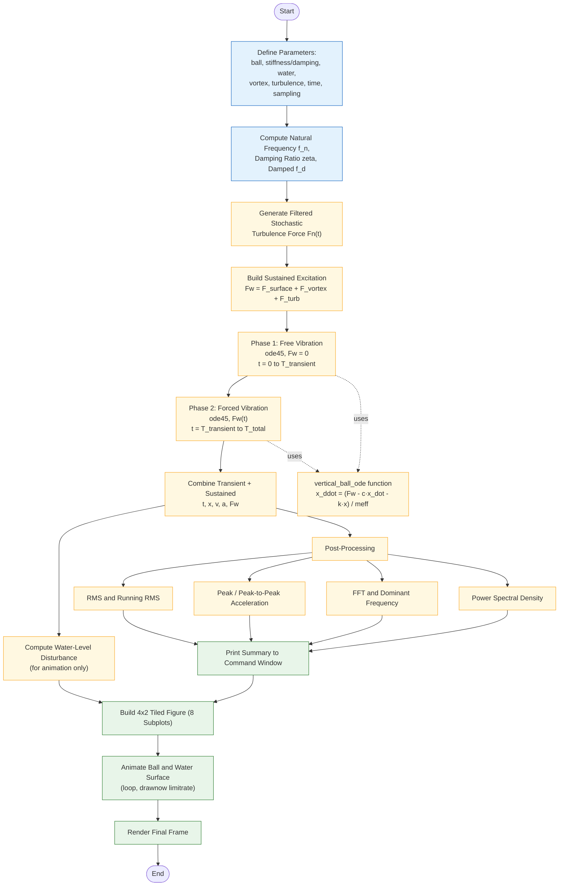

# Vertically Constrained Floating Ball in a Low-Flow Water Canal

*A single-degree-of-freedom (SDOF) vertical fluid–structure interaction (FSI) model, implemented in MATLAB.*


### Highlights

- Two-phase time-domain simulation — free-vibration transient, then sustained hydrodynamic excitation — solved with `ode45`
- Three independent excitation mechanisms: water-surface disturbance, vortex shedding, and filtered stochastic turbulence
- Full vibration-analysis suite (RMS, running RMS, peak / peak-to-peak, FFT, dominant frequency, PSD), implemented **without** the Signal Processing Toolbox
- An 8-panel results figure plus a live 2‑D animation of the ball and water surface
- Fully reproducible via a fixed random seed

---

## Table of Contents

- [Overview](#overview)
- [Demo](#demo)
- [How the Simulation Works](#how-the-simulation-works)
- [Modeling Assumptions](#modeling-assumptions)
- [Parameters](#parameters)
- [Derived Quantities and Quick Insights](#derived-quantities-and-quick-insights)
- [Outputs](#outputs)
- [Requirements](#requirements)
- [How to Run](#how-to-run)
- [Recording a Demo Video](#recording-a-demo-video)
- [Project Structure](#project-structure)
- [Limitations](#limitations)
- [License](#license)

## Overview

This project simulates the vertical dynamics of a small ball floating in a shallow, low-flow water canal while horizontally constrained — for example, by a tether or guide — so it can only move up and down. The vertical motion is modeled as a classic mass–spring–damper system, driven by three physically distinct hydrodynamic effects layered on top of one another: a slow periodic disturbance from the water surface, a higher-frequency force from vortex shedding around the ball, and a broadband stochastic force representing turbulence.

The script runs the model through an initial free-vibration transient, then a longer sustained-excitation phase, extracts standard vibration-analysis metrics, and visualizes everything in an 8-panel figure plus a live animation of the ball moving in a simple 2‑D canal view.

### Governing Equation

```
meff * x_ddot + c * x_dot + k * x = Fw(t)
```

| Symbol | Meaning |
|---|---|
| `x`, `x_dot`, `x_ddot` | vertical displacement, velocity, acceleration — [m], [m/s], [m/s²] |
| `meff` | effective moving mass (ball mass + hydrodynamic added mass) — [kg] |
| `c` | equivalent vertical damping — [N·s/m] |
| `k` | equivalent vertical stiffness — [N/m] |
| `Fw(t)` | fluctuating vertical hydrodynamic force — [N] |

`Fw(t)` is itself the sum of three components:

```
Fw(t) = Aw*sin(2*pi*fw*t) + Av*sin(2*pi*fv*t) + Fn(t)
```

a periodic water-surface term, a periodic vortex-shedding term, and a filtered stochastic turbulence term.

## Demo

> **Note:** no simulation recording was available when this README was generated, so this section is a placeholder. The script currently only *displays* a live animation (Section 19) — it doesn't save one to disk. See [Recording a Demo Video](#recording-a-demo-video) below, then embed the result here.

**Simplest, always-works option — a GIF committed to the repo:**

```markdown

```

**For a real video:** open this README in the GitHub web editor and drag your `.mp4` into the edit box — GitHub uploads it and inserts a working, playable link automatically. A video file simply committed to the repo and referenced by its relative path does **not** reliably play inline, so the drag-and-drop route (or a GIF) is the dependable choice.

## How the Simulation Works



**Two-phase time integration.** The script never solves one continuous ODE — it deliberately splits the simulation into two `ode45` calls:

1. **Transient phase** (`0 → T_transient`): the ball is released from `initial_displacement` with `Fw = 0` and left to oscillate freely, so any start-up transient decays before the "real" excitation begins.
2. **Sustained phase** (`T_transient → T_total`): the ball's state at the end of the transient becomes the initial condition for a second `ode45` call, now driven by the full `Fw(t) = F_surface + F_vortex + F_turb`, interpolated at each solver step through `force_function`.

Both phases call the same local function, `vertical_ball_ode`, which rearranges the governing equation into state-space form (`y = [x; x_dot]`) for the solver.

## Modeling Assumptions

1. **Motion is purely vertical.** The ball is horizontally constrained, so only the vertical degree of freedom is simulated.
2. **Gravity and static buoyancy are pre-balanced** at the equilibrium position, so only *departures* from equilibrium appear in the dynamic equation.
3. **`k` is a lumped equivalent stiffness** — tether/support stiffness, buoyancy restoring force, and structural effects combined.
4. **`c` is a lumped equivalent damping** — water drag, support/material damping, and other dissipation combined.
5. **Mean flow doesn't force the system directly.** `U` only sets the vortex-shedding frequency via the Strouhal relationship; it isn't injected as a constant force.
6. **Turbulence is a filtered-noise approximation**, not a resolved turbulent flow field.
7. **The water-surface disturbance is a single sinusoid** — real canals have more complex wave motion.

> **In short:** a reduced-order engineering model for studying vibration trends, RMS levels, resonance risk, and sensitivity to flow conditions — not a resolved CFD simulation.

## Parameters

### Ball Parameters

| Parameter | Value | Units | Description |
|---|---|---|---|
| `m_ball` | 0.030 | kg | Physical mass of the floating ball |
| `m_added` | 0.005 | kg | Approximate hydrodynamic added mass |
| `meff` *(derived)* | 0.035 | kg | Effective moving mass, `m_ball + m_added` |
| `ball_diameter` | 0.060 | m | Ball diameter |
| `ball_radius` *(derived)* | 0.030 | m | `ball_diameter / 2` — kept for reference; not otherwise used in the force or dynamics calculations |

### Vertical Constraint (Mechanical)

| Parameter | Value | Units | Description |
|---|---|---|---|
| `k` | 12.0 | N/m | Equivalent vertical stiffness. Higher `k` → higher natural frequency, generally smaller displacement for a given force |
| `c` | 0.080 | N·s/m | Equivalent vertical damping. Higher `c` → more dissipation, smaller oscillation amplitude and RMS |

### Water Parameters

| Parameter | Value | Units | Description |
|---|---|---|---|
| `U` | 0.25 | m/s | Mean water velocity — used only to estimate the vortex-shedding frequency, not injected as a constant force |
| `rho` | 1000 | kg/m³ | Water density — printed in the summary for reference; not currently used in any force calculation (added mass and vortex amplitude are specified directly rather than derived from ρ) |

### Water-Surface Disturbance

| Parameter | Value | Units | Description |
|---|---|---|---|
| `Aw` | 0.030 | N | Force amplitude of the water-surface excitation term in `Fw(t)` |
| `fw` | 0.15 | Hz | Frequency of the water-surface disturbance |
| `water_surface_amp` | 0.004 | m | Visible water-level ripple amplitude, used only for the Tile 2 plot and the animation — decoupled from `Aw`, which drives the actual dynamics |

### Vortex Shedding

| Parameter | Value | Units | Description |
|---|---|---|---|
| `St` | 0.20 | – | Strouhal number; 0.1–0.2 is a common engineering estimate for bluff bodies |
| `fv` *(derived)* | ≈ 0.833 | Hz | Vortex shedding frequency, `St · U / ball_diameter` |
| `Av` | 0.020 | N | Force amplitude of the vortex-shedding excitation term |

### Turbulence

| Parameter | Value | Units | Description |
|---|---|---|---|
| `Fn_rms` | 0.008 | N | Target RMS magnitude of the filtered turbulent force |
| `f_turb` | 2.0 | Hz | Approximate turbulence cutoff frequency — higher means faster fluctuations |

### Initial Conditions

| Parameter | Value | Units | Description |
|---|---|---|---|
| `initial_displacement` | 0.020 | m | Initial vertical displacement, kicks off the free-vibration transient |
| `initial_velocity` | 0.000 | m/s | Initial vertical velocity |

### Simulation Time and Sampling

| Parameter | Value | Units | Description |
|---|---|---|---|
| `T_transient` | 8 | s | Duration of the free-vibration phase (`Fw = 0`) |
| `T_sustained` | 60 | s | Duration of the forced, sustained-excitation phase |
| `T_total` *(derived)* | 68 | s | `T_transient + T_sustained` |
| `Fs` | 200 | Hz | Sampling frequency |
| `dt` *(derived)* | 0.005 | s | Sampling interval, `1 / Fs` |

### Post-Processing Window and Reproducibility

| Parameter | Value | Units | Description |
|---|---|---|---|
| `RMS_window_seconds` | 2.0 | s | Length of the moving-RMS window (Tile 7) |
| `RMS_window_samples` *(derived)* | 400 | samples | `round(RMS_window_seconds · Fs)` |
| `rng` seed | 10 | – | Fixes the random turbulence realization so runs are reproducible |

## Derived Quantities and Quick Insights

At the default parameter values above, the script's own calculations work out to:

| Quantity | Symbol | Value |
|---|---|---|
| Undamped natural frequency | `fn_natural` | ≈ 2.947 Hz |
| Damping ratio | `zeta` | ≈ 0.062 (≈ 6.2% of critical) |
| Damped natural frequency | `fd_natural` | ≈ 2.941 Hz |
| Vortex shedding frequency | `fv` | ≈ 0.833 Hz |

A couple of things worth knowing about this configuration:

- **The system is lightly damped** (ζ ≈ 6%). The free-vibration transient's exponential envelope has a time constant of about 0.88 s, so by the end of the 8 s transient window the initial disturbance has decayed to roughly 0.01% of its starting amplitude — `T_transient = 8 s` is a comfortable margin, not a tight one.
- **Neither periodic forcing term sits near resonance** at these defaults: vortex shedding (≈ 0.83 Hz) and the water-surface disturbance (0.15 Hz) are both well below the ≈ 2.95 Hz natural frequency. The turbulence term (broadband up to `f_turb = 2 Hz`) is the component most likely to nudge the system toward its natural frequency — worth watching if `f_turb` is raised toward or past `fn_natural`.

## Outputs

**Command window** — a categorized summary: ball parameters, mechanical parameters, water parameters, excitation parameters, dynamic results (natural frequency, damping, RMS/peak/peak-to-peak acceleration, dominant frequency), and the simulation timing breakdown.

**Figure — 4×2 tiled layout, 8 linked panels:**

| # | Panel | Shows |
|---|---|---|
| 1 | Virtual canal + ball | Schematic cross-section of the canal, tether, and ball — also the panel that animates |
| 2 | Water-surface disturbance | Visible water-level ripple vs. time |
| 3 | Hydrodynamic force | Total force plus its three components vs. time |
| 4 | Vertical displacement | `x(t)` |
| 5 | Vertical velocity | `x_dot(t)` |
| 6 | Vertical acceleration | `x_ddot(t)`, annotated with RMS and peak |
| 7 | Running acceleration RMS | Moving RMS (2 s window), with the sustained-phase RMS as a reference line |
| 8 | Acceleration FFT | Frequency spectrum with natural, vortex, water, and dominant frequencies marked |

A figure-level textbox also summarizes RMS, peak, `fn`, and the dominant frequency in one line at the top of the figure.

**Animation** — the top-left panel plays back the ball's vertical motion and the water surface through the full transient + sustained time history at roughly 25 fps.

## Requirements

- MATLAB R2019b or later (for `tiledlayout` / `nexttile`)
- No additional toolboxes — the script deliberately reimplements moving RMS and the periodogram by hand instead of calling `movrms` or `pwelch`, so it has no Signal Processing Toolbox dependency (see Sections 10 and 15 of the script)

## How to Run

1. Save the script as `vertical_floating_ball_simulation.m` (or your preferred name — the local function `vertical_ball_ode` at the bottom must stay in the same file).
2. Open it in MATLAB and press **Run**, or from the command window: `run('vertical_floating_ball_simulation.m')`.
3. A single figure opens with 8 linked plots; the top-left panel animates the ball and water surface in real time while the command window prints the full numeric summary.
4. The animation plays once through the full transient + sustained history (~68 s of simulated time).
   > **Tip:** the loop doesn't currently check whether the figure is still open, so closing the window mid-animation raises a graphics-handle error in the command window rather than exiting cleanly. Harmless, but if you'd like a silent early exit, add `if ~isvalid(fig); break; end` at the top of the `for` loop in Section 19.
5. Change the random seed (`rng(10)`) or any parameter in Section 1 and re-run to explore other configurations.

## Recording a Demo Video

The animation loop (Section 19) currently only draws to screen. To capture it as an `.mp4` for the [Demo](#demo) section, wrap the loop with `VideoWriter`:

```matlab
% Before the animation loop:
videoObj = VideoWriter('docs/simulation_demo.mp4', 'MPEG-4');
videoObj.FrameRate = round(Fs / animation_skip);
open(videoObj);

for i = 1:animation_skip:length(t)
    % ... existing animation update code ...
    drawnow limitrate;
    writeVideo(videoObj, getframe(fig));   % <-- add this line
end

close(videoObj);   % <-- add after the loop
```

To embed it as a GIF instead (the simplest, most universally compatible option for a README), convert with a tool like ffmpeg:

```bash
ffmpeg -i docs/simulation_demo.mp4 -vf "fps=15,scale=720:-1" docs/simulation_demo.gif
```

then reference it in the [Demo](#demo) section above.

## Project Structure

```
.
├── vertical_floating_ball_simulation.m   # main script + local ODE function
├── docs/
│   └── simulation_demo.gif               # add your recording here
└── README.md
```

*(Adjust to match your actual repository layout — this is a suggested structure, not a requirement.)*

## Limitations

This is a **reduced-order engineering model**, not a resolved computational fluid dynamics (CFD) simulation:

- Forces are represented by sinusoids and filtered noise, not a solved flow field around the ball.
- Coupling is one-way — the ball responds to the water, but the water field isn't modified by the ball's motion.
- The vortex-shedding frequency comes from a single Strouhal-number estimate rather than a Reynolds-number-resolved shedding model; real spheres exhibit more complex, three-dimensional wake behavior than a simple bluff-body estimate captures.
- Horizontal motion, rotation, and coupling to other degrees of freedom are excluded by construction.

Treat the outputs (RMS levels, dominant frequency, resonance margins) as trends and first-order estimates for design or sensitivity studies, not as a substitute for a validated CFD or experimental campaign.

## License

No license was specified for this repository at the time of writing. Add a `LICENSE` file and reference it here (e.g. MIT, BSD-3-Clause, Apache-2.0) before sharing or open-sourcing this work.